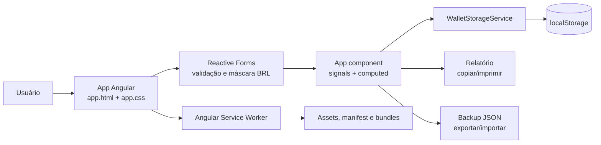
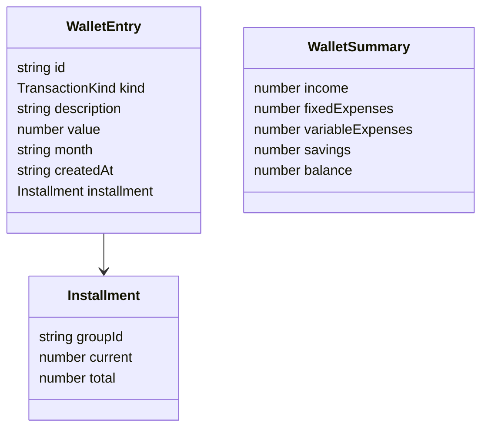
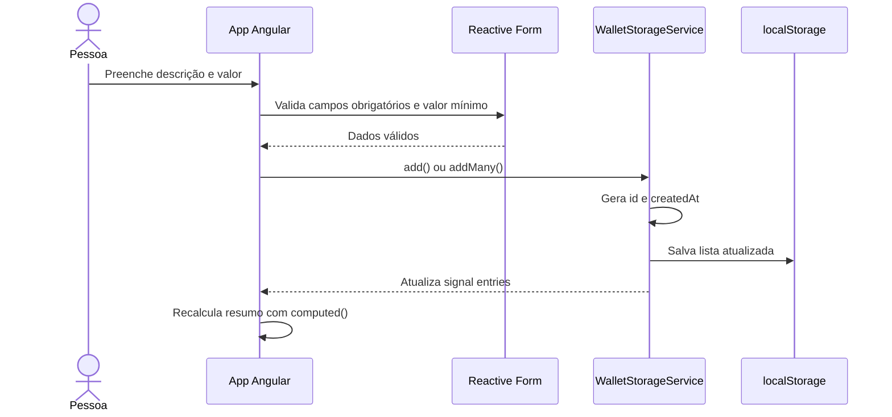
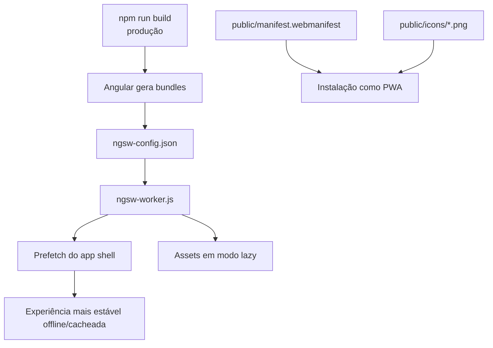

# Sattiva Finanças

Aplicativo web para controle simples de finanças pessoais, com lançamentos por mês, gastos parcelados, cofrinho, resumo mensal, relatório, backup local e suporte a PWA.


## Utilize o Sattiva Finanças

👉 **Acesse:** https://sattva-financas.netlify.app/

[](https://sattva-financas.netlify.app/)
[](https://app.netlify.com/projects/sattva-financas/deploys)

## Visão geral

O Sattva Finanças é uma aplicação Angular standalone focada no uso pessoal e direto no navegador. Os dados ficam salvos no `localStorage`, podem ser exportados/importados em JSON e a build de produção registra um service worker para entregar uma experiência instalável e mais estável como PWA.

## UX/UI e Design

A experiência de usuário (UX) e a interface (UI) do Sattiva Finanças foram desenvolvidas em parceria com **[Jaqueline Lima](https://github.com/jaquelinelima2)**, responsável pela concepção dos fluxos de navegação, identidade visual e protótipos criados no Figma.

O processo de desenvolvimento foi baseado nos protótipos e estudos realizados no Figma, buscando uma experiência simples, intuitiva e focada no uso cotidiano do controle financeiro pessoal.

### Funcionalidades
  
- Lançamento de renda mensal, gastos fixos, gastos variáveis e valores do cofrinho.
- Filtro por mês e navegação por ano.
- Resumo mensal com entradas, saídas e saldo.
- Gastos variáveis parcelados, distribuídos automaticamente nos meses seguintes.
- Remoção inteligente de parcelas: ao remover uma parcela intermediária, as próximas parcelas do mesmo grupo também são removidas.
- Backup em JSON para exportar/importar os dados entre navegadores ou dispositivos.
- Relatório textual com opção de copiar e imprimir.
- Máscara monetária em padrão brasileiro.
- Migração de chaves antigas do `localStorage` para o modelo atual de lançamentos.
- PWA com manifest, ícones e service worker Angular.

## Stacks

| Camada              | Tecnologia                                                                                       |
| ------------------- | ------------------------------------------------------------------------------------------------ |
| Framework           | Angular 21                                                                                       |
| Linguagem           | TypeScript 5.9                                                                                   |
| UI                  | Angular standalone components, template control flow e CSS puro                                  |
| Estado              | Angular Signals e `computed`                                                                     |
| Formulários         | Angular Reactive Forms                                                                           |
| Persistência        | `localStorage`                                                                                   |
| PWA                 | `@angular/service-worker`, `ngsw-config.json`, `manifest.webmanifest` e ícones em `public/icons` |
| Testes              | Angular unit test builder com Vitest                                                             |
| Build               | Angular CLI / `@angular/build`                                                                   |
| Ícones PWA          | Script Node.js com `sharp`                                                                       |
| Pacotes             | npm                                                                                              |

## Arquitetura




### Modelo de dados




### Fluxo de lançamento
  


### Fluxo PWA



## Estrutura


```text
src/
  app/
    app.ts                    # Componente principal e regras da tela
    app.html                  # Template da aplicação
    app.css                   # Estilos da interface
    app.config.ts             # Locale pt-BR e registro do service worker
    wallet-storage.service.ts # Persistência, migração e remoção de parcelas
    wallet.models.ts          # Tipos do domínio financeiro
    real-mask.ts              # Diretiva de máscara monetária
public/
  manifest.webmanifest        # Configuração PWA
  icons/                      # Ícones usados pelo manifest
ngsw-config.json              # Estratégia de cache do Angular Service Worker
scripts/
  generate-icons.js           # Geração dos ícones PWA via sharp
```

## PWA e service worker

O service worker é registrado em `src/app/app.config.ts` com `provideServiceWorker('ngsw-worker.js')` e só fica ativo fora do modo de desenvolvimento. A estratégia usa `registerWhenStable:30000`, aguardando a aplicação estabilizar ou até 30 segundos antes do registro.

O cache é definido em `ngsw-config.json`:

- `app`: arquivos centrais da aplicação, manifest, CSS e JavaScript com `installMode: prefetch`.
- `assets`: imagens, fontes e demais assets com `installMode: lazy` e `updateMode: prefetch`.

Para validar o comportamento PWA, use uma build de produção servida por HTTP. O `ng serve` roda em desenvolvimento e não ativa o service worker.

## Backup e dados

Os lançamentos atuais são salvos na chave `sattva-wallet-entries-v1` do `localStorage`. O backup exporta um arquivo JSON com metadados da aplicação e a lista de lançamentos. Ao importar, os dados atuais do navegador são substituídos pelo conteúdo do arquivo.

O serviço também tenta migrar dados antigos das chaves `rendas`, `gastosFixos` e `gastosVariaveis`, preservando lançamentos válidos no novo formato.
